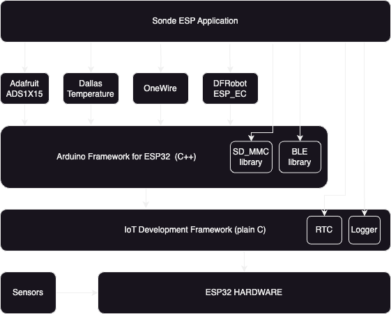
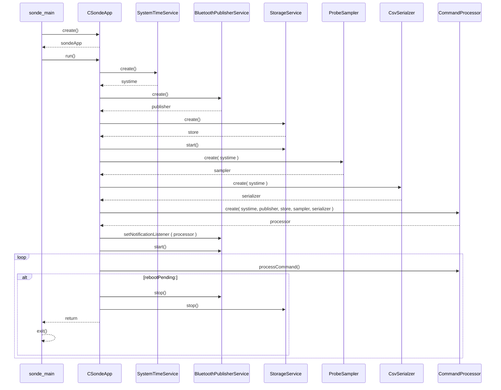
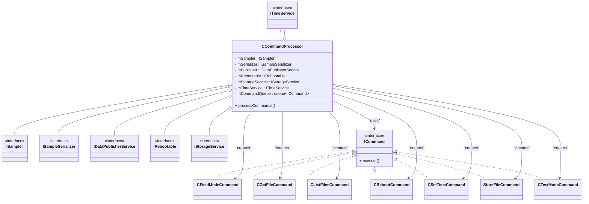
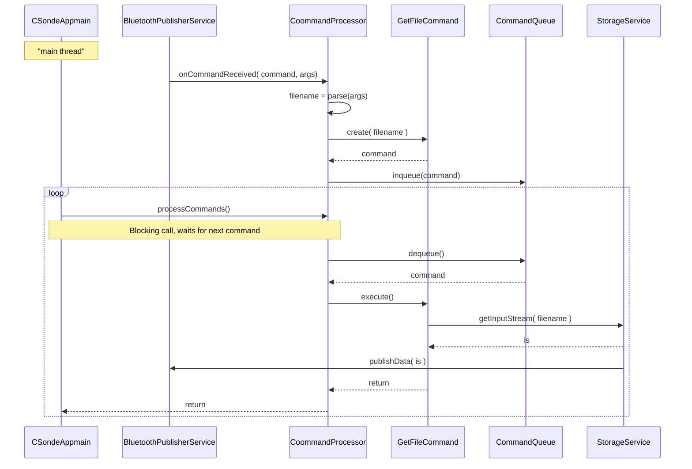
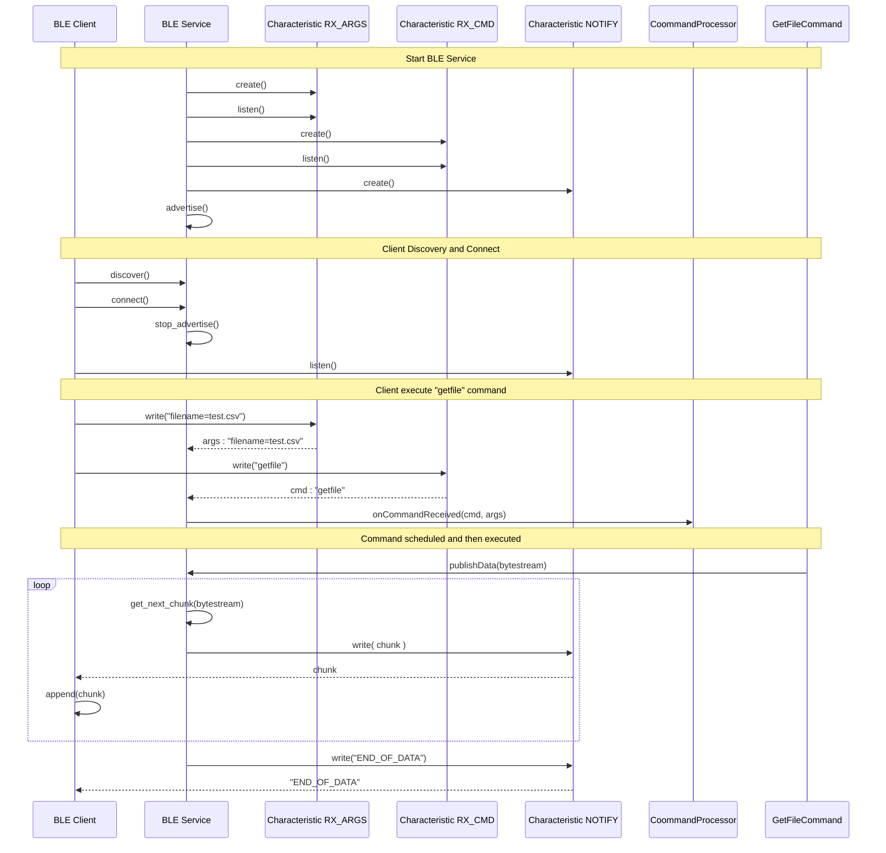
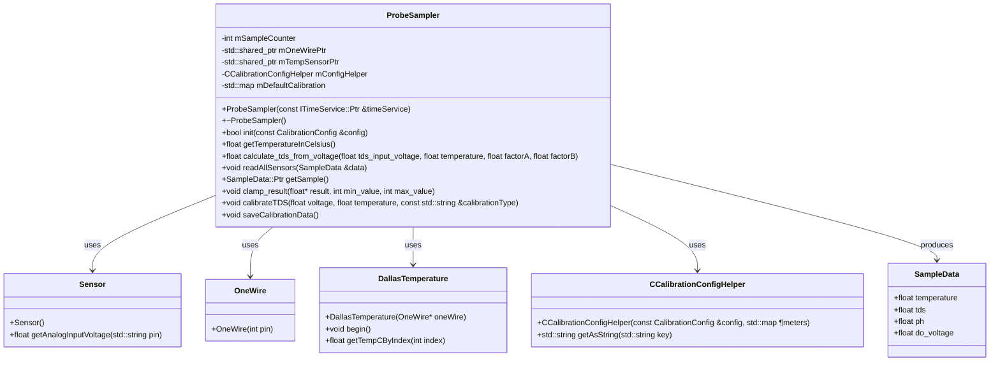

# ESP32 Sonde Firmware

## How to install toolchain

   Follow detailed instructions to install Espressif IDF toolchain here:
   https://docs.espressif.com/projects/esp-idf/en/v5.1.5/esp32/get-started/index.html

   The project is configured to use the Arduino C++ Framework as a dependency to simplify the development process.
   The latest stable version of espressif/arduino-esp32 is 3.0.7 (see main/idf_component.yml).
   That dependency requires the IDF version to be <5.2.X, which is why v5.1.5 of IDF was selected.

   Note: Optionally, if using VS Code, the extension can be installed:
   https://github.com/espressif/vscode-esp-idf-extension/blob/master/docs/tutorial/install.md

   If using VS Code with the IDF extension, syntax highlighting and source code navigation can be added
   by opening the command palette (View -> Command Palette ...) and executing the following command:
   > ESP-IDF: Add .vscode Configuration Folder

   This will add <PROJECT>/.vscode/c_cpp_properties.json that refers to the path of the IDF framework libraries.

## Configuring and building the project
1. Configure the build target as the ESP32 platform by executing the following command in the project root directory:
   % idf.py set-target esp32

   Configuration will take 2-3 minutes as it requires downloading the arduino-esp32 framework.

2. Note: The project comes with an sdkconfig.defaults file that is used during the set-target process and defines all
   necessary overrides to properly configure the ESP32 board (sets the correct size of flash, enables BT, etc.).
   So there is no need to run menuconfig.
   Just in case, the following command can be used to control board configuration:
   % idf.py menuconfig

3. To build the project, simply execute:
   % idf.py build

4. To build and flash:
   % idf.py -p <PORT> flash

   Note: For macOS, the UART port will be under /dev/cu.*
   Example:
   % idf.py -p /dev/cu.wchusbserial2110 flash

   For Linux, the UART port will be under /dev/ttyUSB0. In some cases, you must enable permissions to read and write from that port with the following command before flashing (Fedora):
   % sudo chmod a+rw /dev/ttyUSB0
   % idf.py -p /dev/ttyUSB0 flash

6. To start monitoring the serial port for application output:
   % idf.py -p <PORT> monitor
   Example:
   % idf.py -p /dev/cu.wchusbserial2110 monitor

7. The build is based on CMake. To expand the project with new includes/sources, simply modify main/CMakeLists.txt.

## Firmware Architecture
Here is high level architecture diagram.
- Project is based on ESP32 hardware that is integrated with external water quality sensors
- For basic runtime funtionality ( like RTS, logging etc) native Espressif IDF framework is used
- For more advanced features like Bluetooth stack operation and SD card file system support, Arduino C++ Framework for ESP32 is integrated on top of native IDF. This aproach helps to drastically simplify application code. Besides vast majority of sensors available on the market come with vendor-provided libraries for Arduiono framework. Using Arduino framework as a base, made sensor code integration seamless.

## Application Design

### Overview
The following sequence diagram explains the application workflow.

**CSondeApp** - application entity, has a single method `run`, constructs and initializes all participating components in the proper order, then launches CommandProcessor and establishes a command processing loop. Keeps executing commands until interrupted or an explicit Reboot command is received from the Client Application.

**SystemTimeService** - provides an interface to manage system time.

**BluetoothPublisherService** - acts as a BLE service that manages BLE client connectivity and arranges communication between the Client Application and Sonde using a command-based protocol (explained below).

**StorageService** - manages file system operations. Upon start, mounts the SD card "sentry226" directory as a file system root and arranges access to the SD card /sentry226 directory content.

**ProbeSampler** - interacts with all system water quality sensors and arranges results as individual data samples.

**CsvSerializer** - implements business logic to serialize data samples into CSV format following the DataStream Schema

### Command Processing
Command pattern is used to arange operation of Sonde. As explained in  previous section, upon initializing, Sonde enables BLE Service and waits for BLE Client Application connection. When connection is established, Sonde acts as a service waiting for client commands and processes them one by one (commands execution is serialized).

**CommandProcessor** (see class diagram next) acts as a command management component. It is responsible for:
- parsing of incoming commands and their arguments
- create and initialize of actual commands
- storing created commands in the internal excution queue
- provides method to execute next command

### List of Commands
Below is an overview of currenly supported commands, for details on actual implementation including expected argument list please see source code.

**RebootCommand** - initiates Sonde reboot

**SetTimeCommand** - synchronizes Sonde system time to time that is provided by BLE Client Application

**StoreFileCommand** - Allows client to transfer a file from BLE Client Application and store it into Sonde file system. Client application uses this command in order to update sensor calibration data as we as to deliver static metadata for preparing DataStream CSV.

**ListFilesCommand** - Provides list of files that are currently present under /setry226 SD card directory. Client application uses it to provide list of prepared CSV results, available for download from Sonde

**GetFileCommand** - fetches particular file from Sonde. BLE CLient App uses it to retrieve prepared CSV reports as well as to read currently used sensor calibration configuration and DataStream report metadata parameters

**TestModeCommand** - performs a quick series of samples and reports results in simplified text format back to client. Mostly used as a quick end-to-end functionality validation as well as during sensor calibration procedure.

**FieldModeCommand** - this is a main operation command, command execution starts with disabling BLE service, then Sonde performs continuous data sampling until measured pressure/depth sensor indicates that the surface is reached or optianal watchdog timer times out. The results are then averaged using depth buckets and stored on Sonde SD card as CSV document that follows DataStream schema.

### Command Execution Flow
Below is a sequence diagram that explains the command lifecycle using GetFileCommand as an example. Main steps are:
- A command request is originated from the BLE Client sending a command with arguments to the BLE Service (BluetoothPublisherService).
- The BLE Service notifies the CommandProcessor about the incoming command request.
- The CommandProcessor creates a particular command instance and adds it to the internal CommandQueue.
- At the same time, the main application thread continuously calls the CommandProcessor to process the next command. This call is blocking using synchronization primitives. When a new command emerges in the command queue, the function awakens, retrieves it from the queue, and executes it.
- The GetFileCommand execute method uses the StorageService to retrieve the specified file and sends it back to the BLE Client using the BLE Service as a gateway.

### BLE Service
For wireless communication, the Bluetooth Low Energy protocol is used. Sonde acts as a BLE Service. It arranges the application protocol in order to exchange commands and data. The actual implementation is provided in **CBluetoothPublisherService**. The Client <-> Server communication diagram is explained in the next sequence diagram. Main steps are:
- The Sonde firmware starts advertising the BLE Service. It also registers two read characteristics (one `RX_ARGS`, to receive command arguments; another `RX_CMD` to receive the command name and trigger incoming command notification) and subscribes for change notifications from both. In addition, it also registers one write characteristic called `NOTIFY` to deliver command execution results (data and status) back to the Client.
- The BLE Client (note: client code is not part of this repository) performs BLE Service discovery, connects to the BLE Service, and subscribes to its `NOTIFY` characteristic to listen to BLE command status and data.
- Upon successful connection, the Client and Service negotiate the maximum transfer unit size. 512 bytes is the maximum unit value that the ESP32 BLE stack supports.
- Then, the BLE Client is ready to send the next command for execution (GetFileCommand used in this example). It first writes `RX_ARGS` characteristic with command argument, then it writes `RX_CMD` characteristic with command name.
- BLE Service, upon receiving an update for `RX_CMD`, notifies CommandProcessor about the new command
- Command registration and execution in the command queue was in details covered in the previous session, so for the sake of simplicity is omitted on this diagram
- During the execution, GetFileCommand will prepare a byte stream object and pass it back to BLE Service
- BLE Service sends the content of the byte stream object using `NOTIFY` characteristic using MTU-sized chunks at a time
- Once the entire byte stream is sent, an explicit `END_OF_DATA` marker is also transferred over the same `NOTIFY` characteristic to specify the end of transmission.
- BLE Client keeps receiving and concatenating data on its end until it gets `END_OF_DATA` marker. After that, the command is considered complete.

### Probe Sampling

The ProbeSampler class acts as a central hub for managing sensor data collection, calibration, and stability checks. 

Initialization:

The ProbeSampler starts by initializing sensors, loading calibration data, and checking the stability of the DO sensor voltage.

Sensor Reading:

The ProbeSampler reads data from various sensors:
Temperature sensor (DS18B20).
Pressure sensor.
TDS sensor with temperature compensation.
PH sensor.
DO sensor, ensuring voltage stabilization.

Calibration:

The ProbeSampler supports calibration for sensors:
TDS sensor calibration using buffer solutions.
DO sensor calibration by stabilizing voltage around 42mV.
Calibration data is saved to SD Card for persistence.

DO Sensor Stability:

The DO sensor voltage is checked for stability within a defined range (e.g., ±1mV around 42mV).
If stable, the sensor is initialized; otherwise, the process retries or times out.

