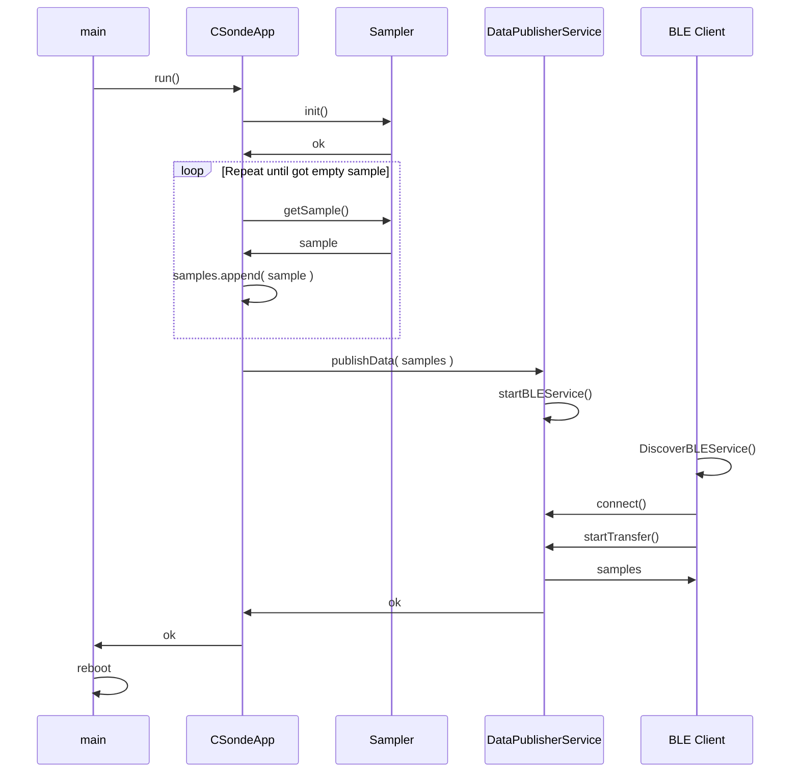

# ESP32 Sonde Firmware


## How to install toolchain

   Follow detailed instructions to install Espressive IDF toolchain here.
   https://docs.espressif.com/projects/esp-idf/en/v5.1.5/esp32/get-started/index.html

   Project is configured to use Arduino C++ Framework as a dependency to simplify development process.
   Latest stable version of espressif/arduino-esp32 is 3.0.7 (see main/idf_component.yml)
   That dependecy requires idf version to be <5.2.X, this is why v5.1.5 of idf was selected

   Note: Optionally, if using VS Code extension can be installed:
   https://github.com/espressif/vscode-esp-idf-extension/blob/master/docs/tutorial/install.md

   If using VS Code with idf extension, syntax highlight and source code navigation can be added
   by openning command palete (View -> Command Palette ...) and executing following command:
   > ESP-IDF: Add .vscode Configuration Folder

   This will add <PROJECT>/.vscode/c_cpp_properties.json that refers path to idf framework libraries


## Configuring and building the project
1. Configure build target as ESP32 platform by executing following command in project root directory:
   % idf.py set-target esp32

   Configuration will take 2-3 minutes as it requires to download arduino-esp32 framework.

2. Note: project comes with sdconfig.defaults file that is used during set-target process and defines all
   necessary overrides to properly configure esp32 board (sets correct size of flash, enables BT etc).
   So there is no need to run menuconfig.
   Just in case, following command can be used to control board configuration
   % idf.py menuconfig

3. To build the project simply execute
   % idf.py build

4. To build and flash
   % idf.py -p <PORT> flash

   Note: for mac UART port will be under /dev/cu.*
   Example:
   % idf.py -p /dev/cu.wchusbserial2110 flash

   For Linux, UART port will be under /dev/ttyUSB0. In some cases, you must enable permissions to read and write from that port with the following command before flash (Fedora):
   % sudo chmod a+rw /dev/ttyUSB0
   % idf.py -p /dev/ttyUSB0 flash

6. To start monitoring serial port for application output
   % idf.py -p <PORT> monitor
   Example:
   % idf.py -p /dev/cu.wchusbserial2110 flash

7. Build is based on CMake, to expand project with new includes/sources simply modify main/CMakeLists.txt

## Application Design
Following sequence diagram explains application workflow.
- CSondeApp - application entity, has a single method run, controls application workflow.
- Sampler - entity responsible for collecting samples.
            Actual implementation interacts with sensors and provides collection of probes (one sample at a time)
- DataPublisherService - responsible to deliver all collected samples to a consumer as a batch data.
                         Actual implementation acts as a BLE service that waits for client connection and transfers
                         collected data to client.
- BLE Client - Mobile client that supports communication over BLE



```mermaid
classDiagram
    class ProbeSampler {
        -int mSampleCounter
        +ProbeSampler(int samples)
        +~ProbeSampler()
        +bool init()
        +std::string getSample()
    }

    class OneWire {
        +OneWire(int pin)
    }

    class DallasTemperature {
        +DallasTemperature(OneWire* oneWire)
        +void begin()
        +void requestTemperatures()
        +float getTempCByIndex(int index)
    }

    ProbeSampler --> OneWire : uses
    ProbeSampler --> DallasTemperature : uses

    class GlobalFunctions {
        +std::string twoDecimalString(float value)
        +float getTemperatureInCelsius(DallasTemperature t)
        +float getAnalogInputVoltage(int inputPin)
        +float getTDS(float inputPin, float temperature)
        +float getConductivity(float inputPin, float temperature)
        +float getPressure(float inputPin)
    }

    ProbeSampler : +const char* TAG = "ProbeSampler"
    ProbeSampler : +float tempC
    ProbeSampler : +float pressure
    ProbeSampler : +float tds
    ProbeSampler : +float conductivity
    ProbeSampler : +float ADC_COMPENSATION = 1
    ProbeSampler : +OneWire oneWire(TEMP_SENSOR_INPUT_PIN)
    ProbeSampler : +DallasTemperature tempSensor(&oneWire)
    ```
